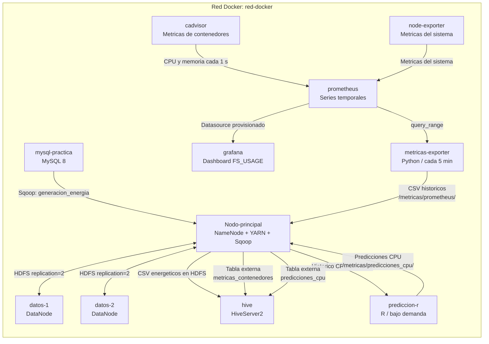

# 🐳 RedDocker — Arquitectura Big Data Distribuida con Docker

> Práctica universitaria de Big Data: pipeline ETL, observabilidad histórica y predicción de CPU sobre un clúster Hadoop distribuido, orquestado con Docker Compose.

---

## 📋 Índice

1. [Introducción](#-introducción)
2. [Arquitectura del sistema](#-arquitectura-del-sistema)
3. [Tecnologías y versiones](#-tecnologías-y-versiones)
4. [Estructura del proyecto](#-estructura-del-proyecto)
5. [Puesta en marcha](#-puesta-en-marcha)
6. [Configuración inicial paso a paso](#-configuración-inicial-paso-a-paso)
   - [Paso 1 — Preparar MySQL](#paso-1--preparar-mysql)
   - [Paso 2 — Importar MySQL → HDFS con Sqoop](#paso-2--importar-mysql--hdfs-con-sqoop)
   - [Paso 3 — Importar HDFS → Hive](#paso-3--importar-hdfs--hive)
7. [Replicación HDFS](#-replicación-hdfs)
8. [Monitorización con Prometheus y Grafana](#-monitorización-con-prometheus-y-grafana)
9. [Histórico de métricas en HDFS y Hive](#-histórico-de-métricas-en-hdfs-y-hive)
10. [Predicción de CPU con R](#-predicción-de-cpu-con-r)
11. [Consultas Hive](#-consultas-hive)
12. [Conclusión](#-conclusión)

---

## 📖 Introducción

**RedDocker** es una práctica de Big Data cuyo objetivo es simular un entorno distribuido de procesamiento de datos energéticos, reproduciendo en local una arquitectura de producción real mediante contenedores Docker.

### Objetivo

El proyecto implementa un pipeline **ETL** (Extract, Transform, Load) completo sobre datos de generación energética, junto a un flujo de análisis histórico del consumo de recursos del clúster. Todo el ecosistema corre sobre una red Docker aislada (`red-docker`), eliminando la necesidad de instalar Hadoop, Hive, Prometheus o R en la máquina anfitriona.

### Flujo ETL

```
┌─────────┐    Sqoop    ┌──────┐    Hive     ┌──────┐
│  MySQL  │ ──────────► │ HDFS │ ──────────► │ Hive │
│  (raw)  │   import    │      │   external  │      │
└─────────┘             └──────┘    table    └──────┘
```

| Etapa | Herramienta | Descripción |
|-------|-------------|-------------|
| **Extract** | MySQL 8 | Almacena los datos energéticos en tablas relacionales |
| **Transfer** | Sqoop 1.4.7 | Importa los datos desde MySQL hacia HDFS en formato de texto |
| **Load** | Hive 4.0.0 | Crea una tabla externa sobre los datos HDFS para consultarlos con HiveQL |

### Flujo de monitorización y predicción

```
cAdvisor ──► Prometheus ──► metricas-exporter ──► HDFS ──► Hive
                    │                                      │
                    └──────────► Grafana                   ▼
                                                    prediccion-r ──► HDFS ──► Hive
```

| Etapa | Herramienta | Descripción |
|---|---|---|
| **Captura** | cAdvisor + Prometheus | Recoge CPU y memoria de los contenedores cada segundo |
| **Visualización** | Grafana | Muestra un dashboard provisionado automáticamente |
| **Histórico** | `metricas-exporter` | Exporta cada 5 minutos CSV de métricas a HDFS |
| **Análisis** | Hive | Consulta métricas históricas almacenadas en HDFS |
| **Predicción** | R | Proyecta uso futuro de CPU y guarda los resultados en HDFS/Hive |

### ¿Por qué Docker?

Docker Compose permite levantar todos los servicios (Hadoop, Hive, MySQL, Sqoop, Prometheus, Grafana y el exportador histórico) con un único comando, garantizando reproducibilidad, aislamiento de red y configuración declarativa del clúster. La predicción R se ejecuta bajo demanda cuando ya existe histórico suficiente.

---

## 🏗️ Arquitectura del sistema

El clúster levanta **10 contenedores permanentes** distribuidos en una red bridge personalizada (`red-docker`) y un contenedor adicional bajo demanda para ejecutar predicciones con R:

### Diagrama de arquitectura



El diagrama separa el pipeline energético original, el histórico de métricas exportado periódicamente a HDFS y la predicción de CPU ejecutada bajo demanda con R.

### Descripción de contenedores

| Contenedor | Imagen base | Rol | Puertos expuestos |
|---|---|---|---|
| `Nodo-principal` | `bde2020/hadoop-namenode:2.0.0-hadoop3.2.1-java8` + Sqoop | **NameNode** + **ResourceManager** + **Sqoop** | `50070`, `8088`, `9000` |
| `datos-1` | `bde2020/hadoop-datanode:2.0.0-hadoop3.2.1-java8` | **DataNode #1** — almacena bloques HDFS | — |
| `datos-2` | `bde2020/hadoop-datanode:2.0.0-hadoop3.2.1-java8` | **DataNode #2** — almacena bloques HDFS | — |
| `mysql-practica` | `mysql:8.0` + Python 3 | **Base de datos relacional** con datos energéticos | `3306` |
| `hive` | `apache/hive:4.0.0` | **HiveServer2** — consultas HiveQL sobre HDFS | `10000`, `10002` |
| `prometheus` | `prom/prometheus` | **Recolección de métricas** del clúster | `9090` |
| `grafana` | `grafana/grafana` | **Visualización de métricas** en dashboards | `3000` |
| `node-exporter` | `prom/node-exporter` | **Métricas del sistema** (CPU, RAM, disco) | `9100` |
| `cadvisor` | `gcr.io/cadvisor/cadvisor` | **Métricas de contenedores** Docker | `8089` |
| `metricas-exporter` | `python:3.12-slim` | **Exportación periódica** de CPU/memoria desde Prometheus a HDFS | — |
| `prediccion-r` | `r-base:4.4.3` | **Predicción bajo demanda** de CPU futura mediante R | — |

### Detalle de los Dockerfiles personalizados

**`hadoop-sqoop/Dockerfile`** — Extiende la imagen oficial de Hadoop NameNode añadiendo:
- Sqoop 1.4.7 descargado desde el archivo oficial de Apache
- Librería `commons-lang-2.6.jar` y `mysql-connector-java-8.0.28.jar` para compatibilidad
- Variables de entorno `SQOOP_HOME` y `HADOOP_CLASSPATH` configuradas permanentemente
- Scripts `start-hadoop.sh` e `importarMYSQL.sh` embebidos en la imagen

**`mysql/Dockerfile`** — Extiende MySQL 8.0 añadiendo:
- Python 3 + `mysql-connector-python` para el generador de datos aleatorios
- Script SQL de inicialización (`init-db.sql`) ejecutado automáticamente al arrancar
- Scripts de carga (`02-load-data.sh`) y generación de datos (`generar_dades.py`)

**`hive/Dockerfile`** — Extiende la imagen oficial de Apache Hive 4.0.0 añadiendo:
- Scripts de migración energética (`migrarEjecutor.sh`, `migrarHDFS.sql`)
- Scripts para tablas y consultas históricas de métricas
- Scripts para almacenar y analizar predicciones de CPU
- Normalización de finales de línea para ejecutar correctamente scripts creados desde Windows

**`metricas-exporter/Dockerfile`** — Ejecuta un script Python que:
- Consulta la API `query_range` de Prometheus
- Exporta CPU y memoria de los contenedores a CSV cada 5 minutos
- Escribe los ficheros en HDFS mediante WebHDFS
- Evita duplicar ventanas ya exportadas y reintenta si HDFS aún no está disponible

**`prediccion-r/Dockerfile`** — Ejecuta un script R que:
- Lee el histórico CSV almacenado en HDFS
- Aplica regresión lineal temporal por contenedor sobre la métrica de CPU
- Genera predicciones para los siguientes 15 minutos
- Guarda un CSV predictivo en HDFS para consultarlo desde Hive

---

## 🛠️ Tecnologías y versiones

| Tecnología | Versión | Función en el proyecto |
|---|---|---|
| **Apache Hadoop** | 3.2.1 | Sistema de ficheros distribuido (HDFS) y gestión de recursos (YARN) |
| **Apache Hive** | 4.0.0 | Motor SQL sobre HDFS — consultas analíticas |
| **Apache Sqoop** | 1.4.7 | Importación de datos relacionales a HDFS |
| **MySQL** | 8.0 | Base de datos origen con datos energéticos |
| **Prometheus** | latest | Recolección y almacenamiento de métricas |
| **Grafana** | latest | Visualización de métricas en tiempo real |
| **cAdvisor** | latest | Métricas CPU/memoria de cada contenedor |
| **Docker** | ≥ 24.x | Motor de contenedores |
| **Docker Compose** | ≥ 2.x | Orquestación declarativa del clúster |
| **Python** | 3.x | Generación de datos y exportación Prometheus → HDFS |
| **R** | 4.4.3 | Cálculo de predicciones de CPU |
| **Java** | 8 | Runtime para Hadoop, Hive y Sqoop |

---

## 📁 Estructura del proyecto

```
RedDocker/
├── docker-compose.yml              # Orquestación de todos los servicios
│
├── hadoop-sqoop/                   # Nodo principal del clúster
│   ├── Dockerfile                  # NameNode + Sqoop personalizado
│   └── scripts/
│       ├── start-hadoop.sh         # Script de arranque de Hadoop
│       └── importarMYSQL.sh        # Pipeline Sqoop: MySQL → HDFS
│
├── hive/                           # Servicio HiveServer2
│   ├── Dockerfile                  # Imagen Hive personalizada
│   ├── lib/
│   │   └── mysql-connector-java-8.0.28.jar
│   └── scripts/
│       ├── migrarEjecutor.sh       # Orquestador de la migración HDFS → Hive
│       ├── migrarHDFS.sql          # DDL y consultas HiveQL del dataset
│       ├── crearMetricasHive.sh    # Crea tabla externa del histórico
│       ├── crearMetricasHive.sql
│       ├── consultarMetricasHistoricas.sh
│       ├── consultasMetricasHistoricas.sql
│       ├── crearPrediccionesHive.sh
│       ├── crearPrediccionesHive.sql
│       ├── consultarPredicciones.sh
│       └── consultasPredicciones.sql
│
├── mysql/                          # Base de datos relacional origen
│   ├── Dockerfile                  # MySQL 8 + Python 3
│   ├── datos_plantas.zip           # Dataset energético comprimido
│   └── scripts/
│       ├── init-db.sql             # Esquema inicial de la base de datos
│       ├── 02-load-data.sh         # Script de carga de datos
│       └── generar_dades.py        # Generador de registros aleatorios
│
├── prometheus/
│   └── prometheus.yml              # Scraping de métricas cada segundo
│
├── grafana/
│   ├── dashboards/
│   │   └── containers-monitoring.json   # Dashboard incluido por defecto
│   └── provisioning/
│       ├── dashboards/dashboards.yml    # Carga automática del dashboard
│       └── datasources/prometheus.yml   # Datasource Prometheus automático
│
├── metricas-exporter/
│   ├── Dockerfile
│   └── scripts/
│       └── exportar_metricas.py    # Prometheus → CSV → HDFS
│
├── prediccion-r/
│   ├── Dockerfile
│   └── scripts/
│       └── predecir_cpu.R          # Histórico CPU → predicción → HDFS
│
└── README.md
```

---

## 🚀 Puesta en marcha

### Prerrequisitos

Asegúrate de tener instalados:

```bash
docker --version        # Docker ≥ 24.x
docker compose version  # Docker Compose ≥ 2.x
```

### Clonar el repositorio

```bash
git clone https://github.com/<usuario>/RedDocker.git
cd RedDocker
```

### Levantar el clúster

```bash
docker compose up -d --build
```

Este comando construye las imágenes personalizadas y levanta los **10 contenedores permanentes** en background, incluido `metricas-exporter`. La primera vez puede tardar varios minutos debido a la descarga de Sqoop y sus dependencias.

El contenedor `prediccion-r` no permanece activo: se ejecuta posteriormente bajo demanda con `docker compose run --rm prediccion-r`.

### Verificar que todos los contenedores están activos

```bash
docker compose ps
```

Todos los servicios deben aparecer con estado `running`. Puedes acceder a las interfaces web en:

| Interfaz | URL |
|---|---|
| Hadoop NameNode UI | http://localhost:50070 |
| YARN ResourceManager | http://localhost:8088 |
| Grafana | http://localhost:3000 |
| Prometheus | http://localhost:9090 |
| cAdvisor | http://localhost:8089 |
| Node Exporter | http://localhost:9100/metrics |
| HiveServer2 | `localhost:10000` (JDBC) |
| Mysql | `localhost:3306` (JDBC) |

---

## ⚙️ Configuración inicial paso a paso

> ⚠️ **Importante:** Los tres pasos siguientes inicializan el flujo energético y deben ejecutarse después de eliminar los volúmenes con `docker compose down -v`. El histórico de métricas se exporta automáticamente, pero sus tablas Hive se crean con scripts independientes descritos más adelante.

---

### Paso 1 — Preparar MySQL

Este paso inicializa la base de datos `energiadb` con su esquema y carga los datos de generación energética.

**1.1 — Acceder al contenedor MySQL:**

```bash
docker exec -it mysql-practica bash
```

> ℹ️ El esquema de la base de datos (`init-db.sql`) se ejecuta automáticamente en el primer arranque del contenedor. No es necesario ejecutarlo manualmente.

**1.2 — Cargar los datos iniciales:**

```bash
bash /02-load-data.sh
```

Este script lee el dataset de plantas eléctricas (`datos_plantas.zip`) e inserta los registros en la tabla `generacion_energia`.

**1.3 — (Opcional) Generar registros aleatorios adicionales:**

```bash
python3 /generar_dades.py
```

Este script Python genera **100 registros adicionales** con valores aleatorios de producción energética, útiles para probar el pipeline con mayor volumen de datos.

**1.4 — Verificar los datos insertados:**

```sql
mysql -u alumne -palumne1234 energiadb
SELECT COUNT(*) FROM generacion_energia;
EXIT;
```

**1.5 — Salir del contenedor:**

```bash
exit
```

---

### Paso 2 — Importar MySQL → HDFS con Sqoop

Este paso transfiere los datos desde MySQL hacia el sistema de ficheros distribuido HDFS, utilizando Sqoop como conector.

**2.1 — Acceder al contenedor Nodo-principal:**

```bash
docker exec -it Nodo-principal bash
```

**2.2 — Ejecutar el script de importación:**

```bash
bash /importarMYSQL.sh
```
> [!WARNING]
> Puede dar error por hdfs no deja ecribir
> ```bash
>  hdfs dfsadmin -safemode leave
> ```

El script `importarMYSQL.sh` realiza automáticamente las siguientes operaciones:

| Paso interno | Acción |
|---|---|
| 🗑️ **Limpieza** | Elimina datos previos en la ruta HDFS destino si existen |
| ☕ **Generación Java** | Sqoop genera clases Java para mapear la tabla MySQL |
| 📥 **Importación** | Transfiere todos los registros a HDFS en formato CSV |
| ✅ **Verificación** | Comprueba bloques replicados y estado del sistema de ficheros |

Los datos quedan almacenados en HDFS en la ruta:

```
/sqoop/energiadb/generacion_energia/
```

**2.3 — Verificar la importación:**

```bash
hdfs dfs -ls /sqoop/energiadb/generacion_energia/
hdfs dfs -cat /sqoop/energiadb/generacion_energia/part-m-00000 | head -20
```

**2.4 — Salir del contenedor:**

```bash
exit
```

---

### Paso 3 — Importar HDFS → Hive

Este paso conecta Hive con los datos almacenados en HDFS, creando una tabla externa que permite lanzar consultas HiveQL directamente sobre los ficheros.

**3.1 — Acceder al contenedor Hive:**

```bash
docker exec -it hive bash
```

**3.2 — Ejecutar el script de migración:**

```bash
bash /migrarEjecutor.sh
```

El script `migrarEjecutor.sh` orquesta las siguientes operaciones (definidas en `migrarHDFS.sql`):

| Operación | Descripción |
|---|---|
| 🗄️ **Crear base de datos** | `CREATE DATABASE IF NOT EXISTS energiadb_hive` en el metastore de Hive |
| 📋 **Crear tabla externa** | `CREATE EXTERNAL TABLE` apuntando a la ruta HDFS de Sqoop |
| 🔗 **Vincular con HDFS** | La tabla externa no mueve datos; lee directamente desde `/sqoop/energiadb/generacion_energia/` |
| 🔍 **Consultas de prueba** | Ejecuta `SELECT COUNT(*)` y `SELECT * LIMIT 10` para validar la integración |

> ℹ️ **Tabla EXTERNAL vs MANAGED:** Se usa una tabla `EXTERNAL` para que Hive no gestione el ciclo de vida de los datos. Si se eliminara la tabla en Hive, los ficheros en HDFS permanecerían intactos.

**3.3 — Salir del contenedor:**

```bash
exit
```

---

## 📊 Replicación HDFS

El clúster está configurado con un **factor de replicación de 2** (`dfs.replication=2`), lo que significa que cada bloque de datos importado por Sqoop se almacena en dos DataNodes simultáneamente (`datos-1` y `datos-2`). Esto garantiza tolerancia a fallos: si un DataNode cae, los datos siguen accesibles desde el otro.

### Verificar el estado del clúster

Desde dentro del contenedor `Nodo-principal`:

```bash
docker exec -it Nodo-principal bash
```

**Informe general del clúster:**

```bash
hdfs dfsadmin -report
```

La salida muestra el estado de cada DataNode, el espacio disponible, bloques configurados y bloques corruptos.

**Inspección de bloques de un path concreto:**

```bash
hdfs fsck /sqoop/energiadb/generacion_energia -files -blocks -locations
```

La salida debe mostrar algo similar a:

```
/sqoop/energiadb/generacion_energia/part-m-00000:
  Under replicated blocks: 0
  Blocks with corrupt replicas: 0
  Missing blocks: 0

Status: HEALTHY
 Total size: XXXXX B
 Total dirs: 1
 Total files: 1
 Total blocks (validated): 1 (avg. block size XXXXX B)
 Minimally replicated blocks: 1 (100.0 %)
 Over-replicated blocks: 0 (0.0 %)
 Under-replicated blocks: 0 (0.0 %)
 Mis-replicated blocks: 0 (0.0 %)
 Default replication factor: 2
 Average block replication: 2.0
```

---

## 📈 Monitorización con Prometheus y Grafana

El clúster incluye una capa de observabilidad para monitorizar el rendimiento de los contenedores y conservar datos para análisis posterior. Prometheus consulta los endpoints configurados cada **1 segundo** (`scrape_interval: 1s`).

### Componentes de monitorización

| Servicio | Función | URL |
|---|---|---|
| **Prometheus** | Recolecta y consulta series temporales | http://localhost:9090 |
| **Grafana** | Visualiza el dashboard provisionado del proyecto | http://localhost:3000 |
| **Node Exporter** | Métricas del sistema host (CPU, RAM, disco, red) | http://localhost:9100/metrics |
| **cAdvisor** | CPU, memoria y red por contenedor Docker | http://localhost:8089 |
| **metricas-exporter** | Guarda históricos CPU/memoria en HDFS | `docker compose logs -f metricas-exporter` |

### Dashboard de Grafana provisionado automáticamente

1. Abrir http://localhost:3000 en el navegador
2. Credenciales por defecto: `admin` / `admin`
3. Abrir la carpeta `RedDocker` y seleccionar el dashboard `FS_USAGE`

No es necesario configurar Prometheus ni importar el dashboard manualmente. Al iniciar Grafana:

- `grafana/provisioning/datasources/prometheus.yml` crea el datasource `Prometheus` con UID estable `prometheus`.
- `grafana/provisioning/dashboards/dashboards.yml` indica dónde cargar dashboards.
- `grafana/dashboards/containers-monitoring.json` crea el dashboard por defecto.

El dashboard incluye paneles para:

| Panel | Métrica |
|---|---|
| `MEMORY_USAGE` | Memoria consumida por contenedor en MiB |
| `CPU_USAGE` | Porcentaje de CPU por contenedor |
| `NETWORK_RECEIVED` | Tráfico de red recibido |
| `NETWORK_SEND` | Tráfico de red enviado |

> ℹ️ Las métricas por contenedor utilizadas para el histórico provienen de **cAdvisor** a través de Prometheus. `node-exporter` aporta métricas generales del sistema, pero no sustituye a cAdvisor para separar `hive`, `Nodo-principal`, `mysql-practica`, `datos-1` y `datos-2`.

---

## 📚 Histórico de métricas en HDFS y Hive

Además de mostrar datos en Grafana, el proyecto almacena un histórico consultable con Hive:

```
cAdvisor → Prometheus → metricas-exporter → HDFS → Hive
```

### Funcionamiento

Prometheus captura CPU y memoria cada segundo. El contenedor `metricas-exporter` ejecuta periódicamente `exportar_metricas.py`, consulta la API HTTP de Prometheus y genera un fichero CSV por cada ventana completa de **5 minutos**.

Cada fichero contiene filas con este formato:

```csv
2026-05-25 11:50:00,Nodo-principal,cpu_usage,85.9759257637444,percent
2026-05-25 11:50:00,hive,memory_usage,406.86328125,MiB
```

Las columnas son:

| Columna | Descripción |
|---|---|
| `instante` | Momento UTC de la muestra |
| `contenedor` | Servicio Docker observado |
| `metrica` | `cpu_usage` o `memory_usage` |
| `valor` | Valor de la métrica |
| `unidad` | `percent` o `MiB` |

Los CSV quedan almacenados en HDFS:

```text
/metricas/prometheus/metricas_YYYYMMDDTHHMMSSZ_YYYYMMDDTHHMMSSZ.csv
```

Con cinco contenedores, dos métricas y muestras de un segundo, una ventana completa puede contener:

```text
5 contenedores × 2 métricas × 300 segundos = 3000 filas
```

### Comprobar la exportación automática

```bash
docker compose logs -f metricas-exporter
docker exec Nodo-principal hdfs dfs -ls /metricas/prometheus
```

Un mensaje correcto de exportación tiene este aspecto:

```text
Exportadas 3000 filas (...) a /metricas/prometheus/metricas_....csv
```

Si aparece `Sin muestras para ...`, Prometheus no tenía datos disponibles para esa ventana; el exportador reintentará y almacenará las siguientes ventanas que sí tengan muestras.

### Exportación manual

Para forzar una ejecución sobre la última ventana completa:

```bash
docker compose run --rm --no-deps metricas-exporter --once
```

El script evita cargar de nuevo un fichero si esa ventana ya se encuentra en HDFS.

### Crear la tabla externa Hive de métricas

Los archivos viven en HDFS; Hive solamente define la estructura para consultarlos:

```bash
docker exec hive bash /crearMetricasHive.sh
```

El script crea:

```sql
metricas_hive.metricas_contenedores
```

apuntando a:

```text
hdfs://Nodo-principal:9000/metricas/prometheus/
```

Cada nuevo CSV que `metricas-exporter` escriba en esa ruta será visible en las siguientes consultas Hive sin recrear la tabla.

### Consultar el histórico

```bash
docker exec -e MOMENTO_CARGA="2026-05-25 12:00:00" hive bash /consultarMetricasHistoricas.sh
```

Sustituye `MOMENTO_CARGA` por el momento en que ejecutaste una carga o consulta de prueba. El análisis incluye:

- Media de memoria por contenedor.
- Máximo de CPU por contenedor.
- Evolución temporal de memoria.
- Comparación de CPU y memoria antes/después de la carga.

---

## 🔮 Predicción de CPU con R

La fase predictiva utiliza el histórico guardado en HDFS para proyectar el consumo futuro de CPU:

```
/metricas/prometheus/*.csv → prediccion-r (R) → /metricas/predicciones_cpu/*.csv → Hive
```

### Modelo utilizado

El script `prediccion-r/scripts/predecir_cpu.R`:

1. Descarga mediante WebHDFS los CSV históricos.
2. Filtra la métrica `cpu_usage`.
3. Entrena una regresión lineal temporal (`lm`) independiente por contenedor.
4. Genera 15 predicciones futuras, una por minuto.
5. Escribe las predicciones en HDFS para analizarlas desde Hive.

Este modelo es deliberadamente simple e interpretable para la práctica. La predicción será más representativa cuanto mayor sea el histórico recogido y cuanto más claros sean los periodos de carga que se quieran estudiar.

### Ejecutar una predicción

El contenedor R se ejecuta bajo demanda, después de disponer de suficientes métricas históricas:

```bash
docker compose build prediccion-r
docker compose run --rm prediccion-r
```

La salida se almacena en:

```text
/metricas/predicciones_cpu/prediccion_cpu_YYYYMMDDTHHMMSSZ.csv
```

### Crear la tabla predictiva en Hive

```bash
docker exec hive bash /crearPrediccionesHive.sh
```

El script crea la tabla externa:

```sql
metricas_hive.predicciones_cpu
```

### Analizar tendencias futuras

```bash
docker exec hive bash /consultarPredicciones.sh
```

Las consultas toman la última ejecución de R y muestran:

- CPU mínima, media y máxima predicha por contenedor.
- Variación de CPU por minuto.
- Clasificación de tendencia: `tendencia_ascendente`, `tendencia_descendente` o `tendencia_estable`.
- Serie temporal futura con las predicciones minuto a minuto.

---

## 🔍 Consultas Hive

Una vez completada la migración, se pueden lanzar consultas HiveQL desde dentro del contenedor `hive`:

```bash
docker exec -it hive bash
beeline -u jdbc:hive2://localhost:10000
```

### Consultas de ejemplo

**Ver los primeros 10 registros:**

```sql
SELECT * FROM energiadb_hive.generacion_energia_mysql LIMIT 10;
```

**Contar el total de registros importados:**

```sql
SELECT COUNT(*) FROM energiadb_hive.generacion_energia_mysql;
```

**Generación total registrada:**

```sql
SELECT SUM(generacion) AS total_generacion
FROM energiadb_hive.generacion_energia_mysql;
```

**Filtrar por rango de fechas:**

```sql
SELECT *
FROM energiadb_hive.generacion_energia_mysql
WHERE fecha BETWEEN '2024-01-01 00:00:00' AND '2024-12-31 23:59:59'
ORDER BY fecha;
```

**Consumo y generación medios por hora del día:**

```sql
SELECT hora_dia, AVG(consumo) AS consumo_medio, AVG(generacion) AS generacion_media
FROM energiadb_hive.generacion_energia_mysql
GROUP BY hora_dia
ORDER BY hora_dia;
```

---

## 🧹 Comandos útiles

### Parar el clúster

```bash
docker compose down
```

### Parar y eliminar volúmenes (reset completo)

```bash
docker compose down -v
```

> ⚠️ Esto elimina MySQL, HDFS, las series temporales de Prometheus y la configuración almacenada en el volumen de Grafana. Grafana volverá a crear su datasource y dashboard desde los archivos provisionados, pero será necesario volver a cargar el dataset energético, esperar nuevas exportaciones de métricas y recrear las tablas Hive externas.

Después de un reset completo, el orden recomendado es:

```bash
docker compose up -d --build
docker exec mysql-practica bash /02-load-data.sh
docker exec Nodo-principal bash /importarMYSQL.sh
docker exec hive bash /migrarEjecutor.sh
docker exec hive bash /crearMetricasHive.sh
```

Cuando `metricas-exporter` ya haya almacenado histórico suficiente:

```bash
docker compose run --rm prediccion-r
docker exec hive bash /crearPrediccionesHive.sh
docker exec hive bash /consultarPredicciones.sh
```

### Ver logs de un servicio

```bash
docker compose logs -f Nodo-principal
docker compose logs -f hive
docker compose logs -f mysql-practica
docker compose logs -f metricas-exporter
```

### Reconstruir imágenes tras modificar un Dockerfile

```bash
docker compose build --no-cache
docker compose up -d
```

---

## 🎓 Conclusión

RedDocker demuestra cómo construir un entorno de Big Data distribuido completamente funcional usando exclusivamente contenedores Docker. A lo largo de la práctica se trabajan los siguientes conceptos clave:

| Concepto | Lo que se aprende |
|---|---|
| **HDFS** | Sistema de ficheros distribuido: bloques, NameNode, DataNodes |
| **Replicación** | Tolerancia a fallos con factor de replicación 2 |
| **Sqoop** | Importación masiva desde bases de datos relacionales a HDFS |
| **Hive** | Consultas analíticas SQL sobre datos no estructurados en HDFS |
| **Pipeline ETL** | Diseño y ejecución de un flujo Extract → Transfer → Load real |
| **Docker distribuido** | Orquestación de múltiples servicios con Docker Compose y redes bridge |
| **Monitorización** | Observabilidad del clúster con Prometheus + Grafana |
| **Provisioning Grafana** | Creación automática de datasource y dashboard tras iniciar Docker |
| **Histórico de métricas** | Persistencia de CPU y memoria de Prometheus en HDFS para consultas Hive |
| **Predicción con R** | Proyección futura de CPU y análisis de tendencias desde Hive |
| **Procesamiento Big Data** | Separación entre almacenamiento (HDFS), procesamiento (YARN) y consulta (Hive) |

Esta arquitectura replica en miniatura patrones de plataformas de datos reales: ingestión relacional, almacenamiento distribuido, consulta SQL, monitorización, persistencia histórica de métricas y un proceso analítico predictivo reproducible.

---

<div align="center">

**RedDocker** · Práctica Big Data · Docker + Hadoop + Hive + Sqoop + Prometheus + Grafana + R

</div>
